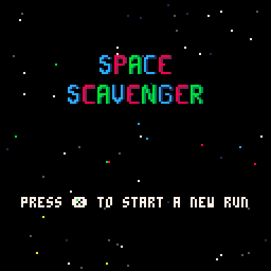
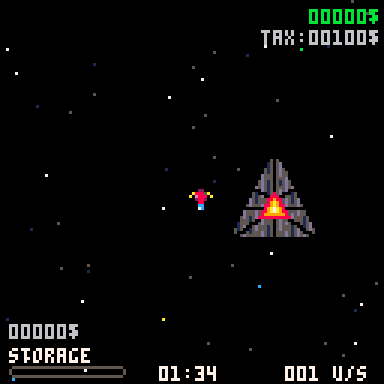
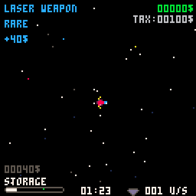
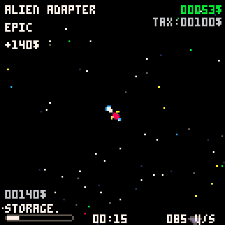
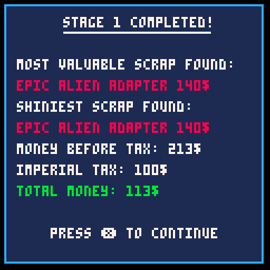
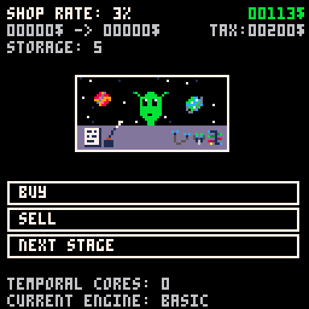
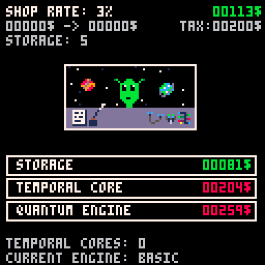

# Space Scavenger

Space Scavenger is a small space exploration and resource-management game
developed with [PICO-8](https://www.lexaloffle.com/pico-8.php).

Play as a space pirate who scavenges valuable resources throughout the galaxy.
Sell your findings, manage your earnings and gather enough money to pay the
Imperial Tax before it is too late.

This project was developed in my free time as a personal game-development
project.

## Gameplay

You are an independent space pirate operating under the watch of the Empire.

Your objective is to:

- explore space;
- discover and collect resources;
- sell your cargo for profit;
- manage your money efficiently;
- pay the Imperial Tax.

The game combines exploration, resource collection and economic decision-making
within the technical constraints of the PICO-8 fantasy console.

## Screenshots









## Built With

- PICO-8
- Lua
- PICO-8 sprite, map, sound and music editors

## Running the Source Version

A licensed installation of PICO-8 is required to open the source cartridge.

1. Clone the repository:

   ```bash
   git clone https://github.com/YOUR_USERNAME/space-scavenger.git
